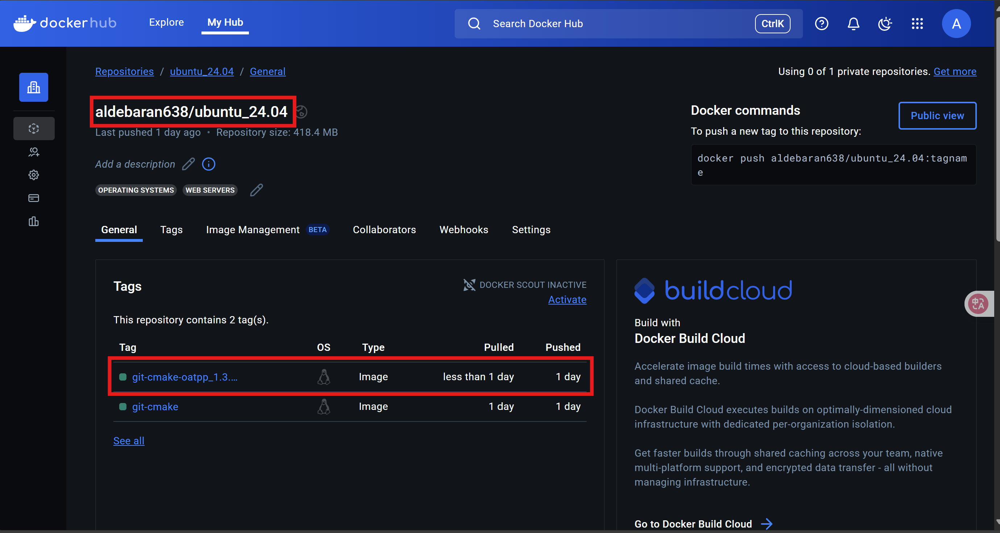

# 2025/05/23

## Docker 镜像构建与优化

**做了什么：**  

编写了一个后端部署 Dockerfile，内容为将安装包（oatpp 组件、connector/C++ 安装包）和源代码复制进入空 Ubuntu 镜像，然后升级 apt，下载必要组件（cmake、git 和 g++）。最后编译执行源代码完成启动。
  
  **问题1：**  
  测试 Dockerfile 功能时，如果只改 Dockerfile 中的内容（如第 24 行），那么 24 行之前的所有内容是有缓存的，可以一口气执行完。但如果相关的文件改了内容，比如源代码，那就要全部重新走一遍。由于安装一些组件非常耗时间（比如 cmake 和 oatpp），所以测试的时候安装了好几次 cmake 和 oatpp，非常浪费时间。

  **解决方案：**  
  先写一个 Dockerfile，创建一个安装好了 cmake 和 oatpp 的 Ubuntu 系统镜像，然后再在这个镜像的基础上去搭建最后的镜像。免去了大量下载时间。

  将本地的镜像上传到 DockerHub 的办法：  
  先将本地镜像名字改成 `<用户名>/<镜像名>:<版本号>` 的格式,如`aldebaran638/Ubuntu_24.04:git-cmake-oatpp_1.3.1`。  
  修改方式为：  
  ```bash
  docker tag <原名称> <修改后的名称>
  ```
  然后直接 push，指令为：  
  ```bash
  docker push <镜像名>
  ```
  push 以后，docker 会根据名字，在 aldebaran638 用户的 Ubuntu_24.04 系列镜像（类似一个仓库）中添加一个 git-cmake-oatpp_1.3.1 版本镜像。
  

  当然，既然能 push，docker 肯定有登录功能。  
  首先如果已经登录要换用户，先要：
  ```bash
  docker logout
  ```
  然后：
  ```bash
  docker login
  ```
  按提示登录即可。如果登录后未退出直接 `docker login`，终端会输出几个信息以后，等候几秒自动退出进程。

**问题2:**  
  有时候在 Dockerfile 里面下载 cmake 等组件时，可能会遇到 file to fetch问题（随机触发），但是手动重试就可以。

  **解决方案：**  
  需要在这些步骤中添加 shell 的循环，在这些步骤执行失败的情况下自动重试（当然如果成功就直接退出）。举个例子：

  ```dockerfile
  RUN echo "升级apt-get工具"
  RUN for i in 1 2 3; do apt-get update && break || (echo "升级apt-get工具失败,重试次数$i" && sleep 2); done
  ```